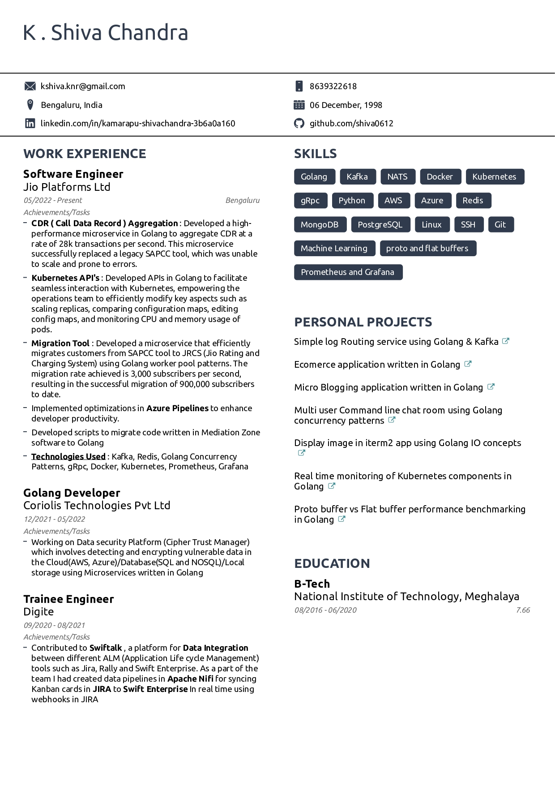

<h1 align="center">Hi 👋, I'm shiva0612</h1>
<h3 align="center">A passionate Backend developer from India</h3>

- 🔭 I’m currently working as **SDE@JIO**
- 📫 Email **kshiva.knr@gmail.com**
- 👨‍💻 Phone [+91-8639322618](+91-8639322618)
- 👯 Tech Used in Current Job **Golang, gRPC, kafka, Docker, Kubernetes, Redis**

<h3 align="left">Connect with me:</h3>

<h3 align="left">Languages and Tools:</h3>

           

